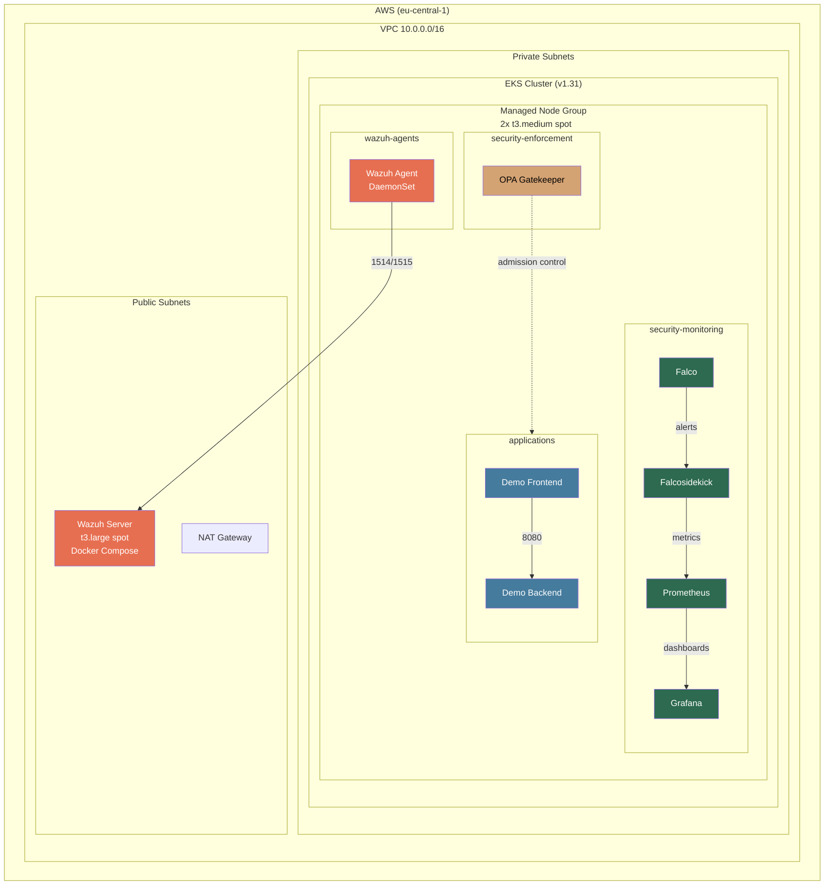

# Kubernetes Security Operations Platform

Infrastructure-as-Code reference implementation of a security-hardened Kubernetes environment on AWS EKS. Demonstrates practical security controls: RBAC, network segmentation, admission control, runtime threat detection, and SIEM integration.

## Architecture



## Security Controls

| Layer | Tool | Purpose |
|-------|------|---------|
| Access Control | RBAC (4-tier model) | Least-privilege access per role |
| Network | NetworkPolicy (VPC CNI) | Default-deny, microsegmentation |
| Admission | OPA Gatekeeper | 6 policies enforcing security standards |
| Runtime | Falco (eBPF) | Real-time threat detection |
| Monitoring | Prometheus + Grafana | Security metrics and dashboards |
| SIEM | Wazuh (external EC2) | Centralized log analysis |
| Encryption | KMS envelope encryption | Secrets encrypted at rest |
| Standards | Pod Security Standards | `restricted` profile on app namespace |

## RBAC Model

| Tier | Role | Scope |
|------|------|-------|
| 1 | Cluster Admin | Full cluster access (break-glass) |
| 2 | Security Operator | Read all, manage security namespaces |
| 3 | App Operator | CRUD in `applications` namespace only |
| 4 | Auditor | Read-only across all namespaces |

## Gatekeeper Policies

1. **No privileged containers** — blocks `privileged: true`
2. **Trusted registries only** — allows docker.io/library, ECR, registry.k8s.io, quay.io, ghcr.io
3. **Required resource limits** — enforces CPU/memory limits
4. **Required labels** — mandates `app`, `team`, `environment` on deployments
5. **No `:latest` tag** — enforces explicit image versions
6. **Read-only root filesystem** — enforces immutable containers

## Quick Start

### Prerequisites

- AWS CLI configured with appropriate credentials
- Terraform >= 1.5.0
- kubectl
- Helm 3

### Deploy Infrastructure

```bash
# Initialize and apply Terraform
cd terraform/environments/dev
terraform init
terraform apply

# Configure kubectl
aws eks update-kubeconfig --region eu-central-1 --name ksop-dev
```

### Deploy Platform Components

```bash
# Deploy everything (namespaces, RBAC, policies, monitoring, demo app)
./kubernetes/scripts/deploy-all.sh

# Optional: Deploy Wazuh agents (requires Wazuh server)
./kubernetes/scripts/deploy-all.sh --wazuh
```

### Verify Security Controls

```bash
# Test RBAC boundaries
./kubernetes/scripts/verify-rbac.sh

# Test network policies
./kubernetes/scripts/test-network-policies.sh

# Test Gatekeeper admission control
./kubernetes/scripts/test-gatekeeper.sh

# Trigger and verify Falco alerts
./kubernetes/scripts/trigger-falco-alerts.sh
```

### Teardown

```bash
cd terraform/environments/dev
terraform destroy
```

## Cost Estimate

| Resource | Spec | Est. Cost |
|----------|------|-----------|
| EKS control plane | 1 cluster | $73/mo |
| Worker nodes | 2x t3.medium spot | ~$15/mo |
| Wazuh EC2 | t3.large spot (opt-in) | ~$22/mo |
| EBS volumes | ~80 GB gp3 | ~$8/mo |
| NAT Gateway | 1 AZ | ~$32/mo |
| **Total (without Wazuh)** | | **~$128/mo** |
| **Total (with Wazuh)** | | **~$150/mo** |

Tear down when not studying to reduce costs to ~$0.

## Project Structure

```
├── .github/workflows/        # CI/CD: terraform lint, k8s lint, trivy scan
├── terraform/
│   ├── environments/dev/      # Dev environment configuration
│   └── modules/
│       ├── vpc/               # VPC with public/private subnets
│       ├── eks/               # EKS cluster with managed node group
│       └── wazuh-server/      # Wazuh SIEM on EC2 (optional)
├── kubernetes/
│   ├── helm-values/           # Prometheus, Falco, Gatekeeper, Falcosidekick
│   ├── manifests/
│   │   ├── namespaces/        # 4 namespaces with Pod Security Standards
│   │   ├── rbac/              # 4-tier RBAC model
│   │   ├── network-policies/  # Default-deny + allow rules
│   │   ├── gatekeeper-policies/
│   │   │   ├── constraint-templates/  # 6 OPA policy templates
│   │   │   ├── constraints/           # Policy instances
│   │   │   └── test-violations/       # Intentionally bad manifests
│   │   ├── demo-app/          # Frontend + backend demo
│   │   ├── wazuh-agents/      # DaemonSet for Wazuh agents
│   │   └── security-monitoring/ # Falco rules, Grafana dashboards
│   └── scripts/               # Deployment and verification scripts
└── docs/                      # Architecture, threat model, runbooks
```

## CI/CD Pipelines

| Workflow | Trigger | Tools |
|----------|---------|-------|
| Terraform Lint | Push/PR on `terraform/**` | `terraform fmt`, `terraform validate`, tfsec, checkov |
| K8s Manifests Lint | Push/PR on `kubernetes/**` | kubeconform, yamllint |
| Trivy Scan | Push/PR + weekly | Trivy (config + IaC scanning) |

## Documentation

- [Architecture & Design Decisions](docs/architecture.md)
- [Threat Model](docs/threat-model.md)
- [Deploy & Teardown Runbook](docs/runbook.md)
- [Cost Analysis](docs/cost-analysis.md)

## License

MIT
