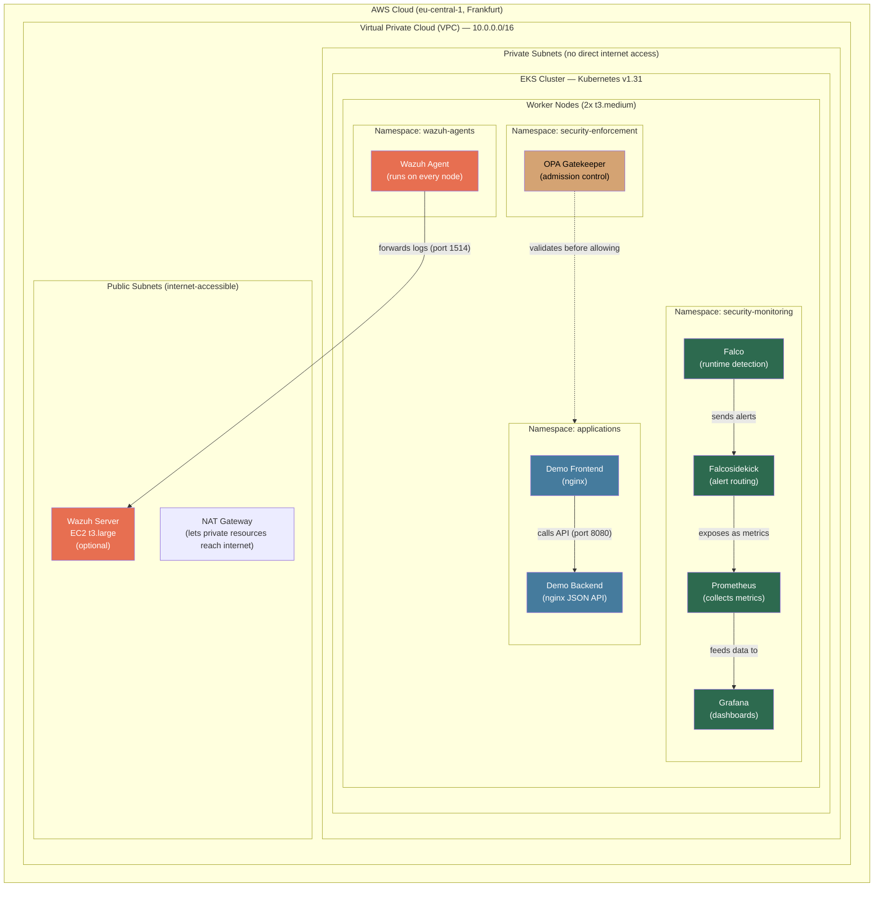

# Kubernetes Security Operations Platform

A complete, security-hardened Kubernetes environment on AWS, built entirely with code (Infrastructure as Code). This project demonstrates how a security engineer would set up, monitor, and protect a Kubernetes cluster using open-source tools.

---

## Table of Contents

- [What Is This Project?](#what-is-this-project)
- [Technologies Used (and Why)](#technologies-used-and-why)
- [Architecture Overview](#architecture-overview)
- [How Everything Connects](#how-everything-connects)
- [Project Structure Explained](#project-structure-explained)
- [Security Layers Explained](#security-layers-explained)
  - [Layer 1: Infrastructure (Terraform)](#layer-1-infrastructure-terraform)
  - [Layer 2: Access Control (RBAC)](#layer-2-access-control-rbac)
  - [Layer 3: Network Segmentation (NetworkPolicy)](#layer-3-network-segmentation-networkpolicy)
  - [Layer 4: Admission Control (OPA Gatekeeper)](#layer-4-admission-control-opa-gatekeeper)
  - [Layer 5: Runtime Detection (Falco)](#layer-5-runtime-detection-falco)
  - [Layer 6: Monitoring (Prometheus + Grafana)](#layer-6-monitoring-prometheus--grafana)
  - [Layer 7: SIEM (Wazuh)](#layer-7-siem-wazuh)
  - [Layer 8: CI/CD Security](#layer-8-cicd-security)
- [Prerequisites](#prerequisites)
- [Step-by-Step Deployment Guide](#step-by-step-deployment-guide)
- [Verification and Testing](#verification-and-testing)
- [Teardown](#teardown)
- [Can I Run This Locally?](#can-i-run-this-locally)
- [Cost Analysis](#cost-analysis)
- [Threat Model](#threat-model)
- [Residual Risks](#residual-risks)

---

## What Is This Project?

Imagine you are a security engineer at a company that runs applications on Kubernetes (a system that manages containers — lightweight packages of software). Your job is to make sure:

- Only authorized people can access the cluster
- Applications can only talk to each other in ways you explicitly allow
- Nobody can deploy dangerous or poorly configured containers
- If someone breaks in, you detect it immediately
- Everything is logged and auditable

This project builds all of that, from scratch, using only code. There is no clicking around in a web console — every single piece of infrastructure and every security rule is defined in files that you can read, version-control, and reproduce.

**The two main tools that make this work:**

1. **Terraform** creates the cloud infrastructure (the virtual network, the Kubernetes cluster, the servers)
2. **Kubernetes manifests and Helm charts** configure everything that runs inside the cluster (security policies, monitoring, applications)

---

## Technologies Used (and Why)

| Technology | What It Is | Why We Use It |
|------------|-----------|---------------|
| **AWS EKS** | Amazon's managed Kubernetes service | AWS runs the Kubernetes control plane for us, so we can focus on security, not cluster maintenance |
| **Terraform** | Infrastructure-as-Code tool | Defines all cloud resources (VPC, EKS, EC2) in `.tf` files — reproducible, versionable, reviewable |
| **Kubernetes** | Container orchestration platform | The thing we are securing — it runs and manages containerized applications |
| **Helm** | Package manager for Kubernetes | Installs complex applications (Prometheus, Falco, Gatekeeper) from pre-built "charts" with our custom settings |
| **OPA Gatekeeper** | Policy admission controller | Acts as a bouncer — checks every container before it is allowed to run, rejects anything that breaks our rules |
| **Falco** | Runtime security tool | Watches every system call (file access, network connections, process execution) inside containers in real-time |
| **Prometheus** | Metrics collection system | Collects numbers (CPU usage, alert counts, error rates) from everything in the cluster |
| **Grafana** | Dashboard visualization tool | Takes Prometheus data and turns it into visual dashboards you can look at in a browser |
| **Wazuh** | SIEM (Security Information and Event Management) | Collects logs from the cluster nodes and analyzes them for security threats — runs on a separate server |
| **GitHub Actions** | CI/CD automation | Runs security scans automatically when code is pushed to the repository |

---

## Architecture Overview

Here is what gets created when you deploy this project:



**In plain language:**

1. Terraform creates a VPC (a private network in AWS) with two zones for reliability
2. Inside the VPC, it creates an EKS cluster with 2 worker nodes (virtual machines that run containers)
3. The worker nodes sit in private subnets (they cannot be reached from the internet directly)
4. A NAT Gateway in the public subnet lets the private nodes download software from the internet
5. Optionally, a separate EC2 machine runs Wazuh (the SIEM server) in the public subnet
6. Inside the Kubernetes cluster, everything is organized into 4 namespaces (isolated compartments)

---

## How Everything Connects

This is the flow of data and control through the system:

```
YOU (developer/security engineer)
  │
  ├── terraform apply ──────────────────► AWS creates VPC, EKS cluster, (optionally Wazuh EC2)
  │
  ├── kubectl / deploy-all.sh ──────────► Kubernetes receives manifests and creates resources:
  │     │
  │     ├── Namespaces are created (4 isolated compartments)
  │     ├── RBAC rules are applied (who can do what)
  │     ├── Network policies are applied (who can talk to whom)
  │     ├── Gatekeeper is installed (policy bouncer)
  │     ├── Prometheus + Grafana are installed (monitoring)
  │     ├── Falco is installed (runtime detection)
  │     └── Demo app is deployed (test workload)
  │
  └── Verification scripts ─────────────► Automated tests prove everything works:
        ├── verify-rbac.sh        → "Can user X do action Y? Expected: no. Got: no. PASS"
        ├── test-network-policies.sh → "Can pod A reach pod B? Expected: blocked. Got: blocked. PASS"
        ├── test-gatekeeper.sh    → "Can I deploy a bad container? Expected: rejected. Got: rejected. PASS"
        └── trigger-falco-alerts.sh → "I opened a shell in a container. Falco detected it? PASS"
```

**The key insight:** Each layer is independent but they reinforce each other. Even if an attacker bypasses one layer, the others still protect you. This is called "defense in depth."

---

## Project Structure Explained

```
kubernetes-security-operations-platform/
│
├── terraform/                          # LAYER 1: Cloud infrastructure (AWS resources)
│   ├── modules/                        # Reusable building blocks
│   │   ├── vpc/                        # Creates the network (VPC, subnets, NAT gateway)
│   │   │   ├── main.tf                 #   Uses terraform-aws-modules/vpc/aws
│   │   │   ├── variables.tf            #   Inputs: cluster_name, vpc_cidr, environment
│   │   │   └── outputs.tf             #   Outputs: vpc_id, subnet IDs
│   │   ├── eks/                        # Creates the Kubernetes cluster
│   │   │   ├── main.tf                 #   KMS encryption, IRSA, control plane logging, spot nodes
│   │   │   ├── variables.tf            #   Inputs: cluster_name, version, instance types
│   │   │   └── outputs.tf             #   Outputs: cluster_name, endpoint, OIDC ARN
│   │   └── wazuh-server/              # Creates the Wazuh SIEM server (optional)
│   │       ├── main.tf                 #   EC2 instance + security group
│   │       ├── variables.tf            #   Inputs: instance_type, allowed CIDRs
│   │       ├── outputs.tf             #   Outputs: public/private IP, dashboard URL
│   │       ├── user-data.sh            #   Bootstrap script (installs Docker, starts Wazuh)
│   │       └── docker-compose.yml      #   3 containers: indexer, manager, dashboard
│   └── environments/dev/              # Configuration for the dev deployment
│       ├── main.tf                     #   Wires the 3 modules together
│       ├── variables.tf                #   All configurable parameters with defaults
│       ├── terraform.tfvars            #   Actual values (project_name=ksop, region, etc.)
│       ├── outputs.tf                 #   What terraform prints after apply
│       ├── versions.tf                #   Provider version constraints (AWS ~>5.0)
│       └── backend.tf                 #   Remote state storage (S3, optional)
│
├── kubernetes/                         # LAYERS 2-7: Everything inside the cluster
│   ├── manifests/                      # YAML files that define Kubernetes resources
│   │   ├── namespaces/                 # 4 isolated compartments
│   │   │   ├── applications.yaml       #   PSS: restricted (strictest security)
│   │   │   ├── security-monitoring.yaml#   PSS: privileged (Falco needs host access)
│   │   │   ├── security-enforcement.yaml#  PSS: baseline
│   │   │   └── wazuh-agents.yaml       #   PSS: privileged (agents read host logs)
│   │   ├── rbac/                       # Who can do what
│   │   │   ├── service-accounts.yaml   #   3 ServiceAccounts (identities for automation)
│   │   │   ├── cluster-roles.yaml      #   3 ClusterRoles (cluster-wide permission sets)
│   │   │   ├── roles.yaml             #   3 Roles (namespace-scoped permission sets)
│   │   │   └── role-bindings.yaml     #   Bindings (connect users/groups to roles)
│   │   ├── network-policies/           # Who can talk to whom
│   │   │   ├── default-deny.yaml       #   Block ALL traffic in every namespace
│   │   │   ├── allow-dns.yaml         #   Then allow DNS (otherwise nothing works)
│   │   │   ├── applications-policies.yaml # Then allow specific app traffic
│   │   │   ├── security-monitoring-policies.yaml # Allow Prometheus scraping, etc.
│   │   │   └── wazuh-agents-policies.yaml # Allow agents to talk to Wazuh server
│   │   ├── gatekeeper-policies/        # What containers are allowed to run
│   │   │   ├── constraint-templates/   #   6 policy templates (written in Rego language)
│   │   │   ├── constraints/           #   6 policy instances (which namespaces, what params)
│   │   │   └── test-violations/       #   6 intentionally bad pods (prove policies work)
│   │   ├── demo-app/                   # A simple test application
│   │   │   ├── frontend.yaml          #   nginx serving on port 80
│   │   │   └── backend.yaml           #   nginx JSON API on port 8080
│   │   ├── wazuh-agents/              # Wazuh agent DaemonSet
│   │   │   ├── wazuh-agent-config.yaml #   ConfigMap with manager IP
│   │   │   └── wazuh-agent-daemonset.yaml # Runs an agent on every node
│   │   └── security-monitoring/        # Custom configs for monitoring tools
│   │       ├── falco-custom-rules.yaml #   4 custom Falco detection rules
│   │       └── grafana-dashboards.yaml #   Grafana dashboard (3 panels)
│   ├── helm-values/                    # Custom settings for Helm-installed tools
│   │   ├── prometheus-stack.yaml       #   Prometheus + Grafana + AlertManager settings
│   │   ├── falco.yaml                 #   Falco settings (eBPF driver, custom rules)
│   │   ├── falcosidekick.yaml         #   Alert routing settings
│   │   └── gatekeeper.yaml            #   OPA Gatekeeper settings
│   └── scripts/                        # Automation scripts
│       ├── deploy-all.sh              #   Deploys EVERYTHING in the right order
│       ├── verify-rbac.sh             #   21 automated RBAC permission checks
│       ├── test-network-policies.sh   #   4 network connectivity tests
│       ├── test-gatekeeper.sh         #   Tests all 6 policies + 1 compliant pod
│       └── trigger-falco-alerts.sh    #   Simulates 4 attacks and checks detection
│
├── .github/workflows/                  # LAYER 8: CI/CD security scanning
│   ├── terraform-lint.yml             #   Validates Terraform code + tfsec + checkov
│   ├── k8s-manifests-lint.yml         #   Validates K8s YAML with kubeconform + yamllint
│   └── trivy-scan.yml                #   Scans for misconfigurations with Trivy
│
└── docs/                               # Additional documentation
    ├── architecture.md                #   Design decisions explained
    ├── threat-model.md                #   What threats each control mitigates
    ├── runbook.md                     #   Step-by-step deploy/teardown procedures
    └── cost-analysis.md               #   Detailed cost breakdown
```

---

## Security Layers Explained

### Layer 1: Infrastructure (Terraform)

**What it does:** Creates the AWS network and Kubernetes cluster with security baked in from the start.

**Key security features:**
- **Private subnets** — Worker nodes cannot be reached from the internet. They sit behind a NAT Gateway.
- **KMS encryption** — Kubernetes Secrets (passwords, API keys stored in the cluster) are encrypted at rest using a customer-managed encryption key, not just the default AWS key.
- **Control plane logging** — Every API call to the cluster is logged to CloudWatch. If someone does something suspicious, there is a record.
- **IRSA (IAM Roles for Service Accounts)** — Instead of giving all pods on a node the same AWS permissions, each pod can have its own AWS role. This is least-privilege at the pod level.

**Files:** `terraform/modules/vpc/`, `terraform/modules/eks/`, `terraform/modules/wazuh-server/`

---

### Layer 2: Access Control (RBAC)

**What it does:** Defines WHO can do WHAT in the cluster, using a 4-tier model.

Think of it like office building security:
- **Tier 1 (Cluster Admin)** = The building owner. Can go anywhere, do anything. Only for emergencies.
- **Tier 2 (Security Operator)** = The security team. Can see all rooms (read-only) and fully manage the security office (security-monitoring and security-enforcement namespaces). Cannot touch the developers' office.
- **Tier 3 (App Operator)** = A developer. Can only work in their own office (applications namespace). Cannot even see the security office.
- **Tier 4 (Auditor)** = The compliance inspector. Can look at everything (including secrets) but cannot change anything at all.

**How it works technically:**
- `ClusterRoles` define permission sets (e.g., "can read pods in all namespaces")
- `Roles` define namespace-scoped permissions (e.g., "can create deployments in applications")
- `ClusterRoleBindings` and `RoleBindings` connect users/groups to these roles

**Key design decision:** The Security Operator's write access is not in the ClusterRole. The ClusterRole only gives read-only access. Write access is granted through separate namespace-scoped Roles in `security-monitoring` and `security-enforcement`. This ensures they cannot accidentally (or intentionally) modify resources in the `applications` namespace.

**Files:** `kubernetes/manifests/rbac/`

---

### Layer 3: Network Segmentation (NetworkPolicy)

**What it does:** Controls which pods can talk to which other pods, at the network level.

**The model is "default deny, explicit allow":**

1. First, we block ALL traffic (ingress and egress) in every namespace — this is `default-deny.yaml`
2. Then, we allow DNS (otherwise pods cannot resolve service names) — this is `allow-dns.yaml`
3. Then, we open specific paths that are needed:
   - Frontend can receive requests on port 80
   - Frontend can send requests to Backend on port 8080
   - Backend can ONLY receive from Frontend (not from the internet, not from other namespaces)
   - Prometheus can scrape metrics from any namespace
   - Wazuh agents can send logs to the external Wazuh server

**Why this matters:** Without network policies, any pod can talk to any other pod. If an attacker compromises the demo app, they could reach Prometheus, Grafana, or even try to attack Gatekeeper. Network policies prevent this lateral movement.

**Files:** `kubernetes/manifests/network-policies/`

---

### Layer 4: Admission Control (OPA Gatekeeper)

**What it does:** Acts as a bouncer at the door. Every time someone tries to create or update a resource (like a Pod or Deployment), Gatekeeper checks it against your policies. If it violates any policy, it is rejected before it ever runs.

**The 6 policies:**

| Policy | What It Blocks | Why |
|--------|---------------|-----|
| No Privileged Containers | Containers with `privileged: true` | A privileged container has full access to the host — essentially root on the machine |
| Trusted Registries | Images from unknown registries | Prevents pulling malicious images from random Docker registries |
| Required Resource Limits | Containers without CPU/memory limits | Without limits, one container can eat all resources and crash the node |
| Required Labels | Deployments without `app`, `team`, `environment` labels | Labels enable tracking who owns what and cost allocation |
| No `:latest` Tag | Images tagged as `latest` | `:latest` is mutable — the same tag can point to different code tomorrow. Pins ensure reproducibility |
| Read-Only Root Filesystem | Containers with writable root filesystem | If an attacker gets in, they cannot write malware to the filesystem |

**How it works:**
- `ConstraintTemplates` define the policy logic in a language called Rego (e.g., "check if this container has resource limits")
- `Constraints` activate a template with specific parameters (e.g., "apply the resource limits check to pods in the `applications` namespace")
- `test-violations/` contains 6 intentionally bad pods that SHOULD be rejected — this proves the policies work

**Files:** `kubernetes/manifests/gatekeeper-policies/`

---

### Layer 5: Runtime Detection (Falco)

**What it does:** Monitors everything happening inside containers in real-time by watching Linux system calls (syscalls) via eBPF. If something suspicious happens, Falco raises an alert.

**The 4 custom detection rules:**

| Rule | What It Detects | Real-World Attack |
|------|----------------|-------------------|
| Terminal Shell in Container | Someone opens bash/sh/zsh inside a container | Attacker got RCE and is exploring |
| Sensitive File Access | A process reads `/etc/shadow` or `/etc/passwd` | Credential harvesting attempt |
| Unexpected Outbound Connection | Container connects to a non-private IP | Data exfiltration or C2 communication |
| Privilege Escalation Attempt | `setuid`/`setgid` syscalls inside a container | Trying to gain root privileges |

**How alerts flow:**
1. Falco (runs as a DaemonSet on every node) detects the event
2. Falco sends the alert to Falcosidekick via HTTP
3. Falcosidekick exposes the alert as a Prometheus metric
4. Prometheus scrapes that metric
5. Grafana displays it on a dashboard

**Files:** `kubernetes/helm-values/falco.yaml`, `kubernetes/manifests/security-monitoring/falco-custom-rules.yaml`

---

### Layer 6: Monitoring (Prometheus + Grafana)

**What it does:** Collects metrics from everything in the cluster and visualizes them in dashboards.

**Components (installed together as "kube-prometheus-stack"):**
- **Prometheus** — Collects metrics by "scraping" endpoints every 30 seconds. Stores 24 hours of data.
- **Grafana** — Web UI for dashboards. Access via `kubectl port-forward` on port 3000.
- **AlertManager** — Receives alerts from Prometheus. In this dev setup, alerts go to a "null" receiver (logged but not forwarded). In production, you would connect Slack, PagerDuty, etc.
- **Node Exporter** — Collects host-level metrics (CPU, memory, disk) from each node.
- **Kube State Metrics** — Collects Kubernetes object state (pod counts, deployment status, etc.).

**Custom Grafana dashboard (3 panels):**
1. Falco alerts over time
2. Gatekeeper policy violations
3. Network policy drops

**Files:** `kubernetes/helm-values/prometheus-stack.yaml`, `kubernetes/manifests/security-monitoring/grafana-dashboards.yaml`

---

### Layer 7: SIEM (Wazuh)

**What it does:** Wazuh is a full Security Information and Event Management (SIEM) system. It collects logs from the Kubernetes nodes, analyzes them for threats, and provides a web dashboard.

**Why it runs on a separate EC2 instance (not inside the cluster):**
- If the cluster crashes, you lose your monitoring. A SIEM that monitors a system should be independent from that system.
- Wazuh needs ~6 GB RAM — too heavy for the small EKS nodes.
- A single EC2 with Docker Compose is cheaper than scaling the node group.

**Architecture:**
- **Wazuh Manager** (Docker container on EC2) — receives and processes agent events
- **Wazuh Indexer** (Docker container on EC2) — OpenSearch-based storage for events
- **Wazuh Dashboard** (Docker container on EC2) — web UI (accessible at `https://<EC2-IP>:443`)
- **Wazuh Agent** (DaemonSet in Kubernetes) — runs on every EKS node, reads host logs, forwards to Manager

**Files:** `terraform/modules/wazuh-server/`, `kubernetes/manifests/wazuh-agents/`

---

### Layer 8: CI/CD Security

**What it does:** Automatically scans the code every time you push to GitHub. Three workflows:

| Workflow | What It Checks | Tools Used |
|----------|---------------|------------|
| Terraform Lint | Terraform formatting, syntax validity, security misconfigurations | `terraform fmt`, `terraform validate`, tfsec, Checkov |
| K8s Manifests Lint | Kubernetes YAML correctness and formatting | kubeconform, yamllint |
| Trivy Scan | Misconfigurations across everything (Terraform, Kubernetes, Dockerfiles) | Trivy |

**Files:** `.github/workflows/`

---

## Prerequisites

Before you can deploy this project, you need:

| Tool | What It Is | How to Install |
|------|-----------|----------------|
| **AWS Account** | A cloud account with billing enabled | [aws.amazon.com](https://aws.amazon.com) |
| **AWS CLI** | Command-line tool to interact with AWS | `brew install awscli` (macOS) or [docs](https://docs.aws.amazon.com/cli/latest/userguide/getting-started-install.html) |
| **Terraform** | Infrastructure-as-Code tool (v1.5+) | `brew install terraform` or [terraform.io](https://developer.hashicorp.com/terraform/install) |
| **kubectl** | Kubernetes command-line tool | `brew install kubectl` or [kubernetes.io](https://kubernetes.io/docs/tasks/tools/) |
| **Helm** | Kubernetes package manager (v3) | `brew install helm` or [helm.sh](https://helm.sh/docs/intro/install/) |
| **git** | Version control | Already installed on macOS |

**AWS CLI must be configured with credentials:**

```bash
aws configure
# Enter: AWS Access Key ID, Secret Access Key, region (eu-central-1), output format (json)
```

Your AWS IAM user needs permissions to create: VPCs, EKS clusters, EC2 instances, KMS keys, IAM roles. The simplest option for a learning project is `AdministratorAccess`, but in production you would use a more restricted policy.

---

## Step-by-Step Deployment Guide

### Step 1: Clone the repository

```bash
git clone <repository-url>
cd kubernetes-security-operations-platform
```

### Step 2: Create AWS infrastructure with Terraform

```bash
cd terraform/environments/dev

# Download the required Terraform providers and modules
terraform init

# Preview what will be created (review this carefully!)
terraform plan

# Create everything (takes ~15-20 minutes)
# Type "yes" when prompted
terraform apply
```

This creates:
- A VPC with 2 public and 2 private subnets
- An EKS cluster with 2 worker nodes (t3.medium spot instances)
- A KMS key for secret encryption
- All necessary IAM roles, security groups, and networking

### Step 3: Connect kubectl to the cluster

```bash
# This command is also shown in the terraform output
aws eks update-kubeconfig --region eu-central-1 --name ksop-dev

# Verify — you should see 2 nodes in "Ready" status
kubectl get nodes
```

### Step 4: Deploy the platform

```bash
# Go back to the project root
cd ../../..

# Make the scripts executable (one-time)
chmod +x kubernetes/scripts/*.sh

# Deploy everything in the correct order
./kubernetes/scripts/deploy-all.sh
```

This takes ~10-15 minutes and deploys (in order):
1. Namespaces
2. RBAC rules
3. Network policies
4. OPA Gatekeeper (via Helm) + constraint templates + constraints
5. Prometheus + Grafana (via Helm)
6. Falco + Falcosidekick (via Helm)
7. Demo application
8. Custom Falco rules and Grafana dashboards

### Step 5: Verify everything works

```bash
# Check that all pods are running
kubectl get pods --all-namespaces

# Run the verification scripts
./kubernetes/scripts/verify-rbac.sh
./kubernetes/scripts/test-gatekeeper.sh
./kubernetes/scripts/test-network-policies.sh
./kubernetes/scripts/trigger-falco-alerts.sh
```

### Step 6: Access Grafana dashboards

```bash
# Forward Grafana's port to your local machine
kubectl port-forward svc/kube-prometheus-stack-grafana 3000:3000 -n security-monitoring

# Open in your browser: http://localhost:3000
# Username: admin
# Password: admin
```

### Step 7: (Optional) Deploy Wazuh

```bash
cd terraform/environments/dev

# Edit terraform.tfvars and change: deploy_wazuh = true
# Then apply
terraform apply

# Get the Wazuh server IP
terraform output wazuh_private_ip

# Update the agent config with the IP
# Edit kubernetes/manifests/wazuh-agents/wazuh-agent-config.yaml
# Replace WAZUH_MANAGER_IP_PLACEHOLDER with the actual IP

# Deploy agents
cd ../../..
./kubernetes/scripts/deploy-all.sh --wazuh

# Access the Wazuh dashboard
# URL: https://<wazuh_public_ip>:443
# Username: admin
# Password: SecretPassword
```

---

## Verification and Testing

The project includes 4 verification scripts that serve as automated proof that the security controls work. These are not just tests — they are first-class deliverables that demonstrate the platform's capabilities.

### RBAC Verification (`verify-rbac.sh`)

Runs 21 `kubectl auth can-i` checks to verify all 4 RBAC tiers:

```
Tier 1 (Cluster Admin):  CAN create deployments anywhere         ✓
Tier 2 (Security Operator): CAN create in security-monitoring    ✓
Tier 2 (Security Operator): CANNOT delete in applications        ✓
Tier 2 (Security Operator): CANNOT access secrets in kube-system ✓
Tier 3 (App Operator): CAN deploy in applications                ✓
Tier 3 (App Operator): CANNOT see security-monitoring            ✓
Tier 4 (Auditor): CAN read everything                            ✓
Tier 4 (Auditor): CANNOT create or delete anything               ✓
```

### Gatekeeper Policy Tests (`test-gatekeeper.sh`)

Tries to deploy 6 intentionally bad pods — each should be rejected:

```
test-privileged:          Rejected (privileged: true)             ✓
test-untrusted-registry:  Rejected (malicious-registry.io)       ✓
test-no-resource-limits:  Rejected (no CPU/memory limits)        ✓
test-no-labels:           Rejected (missing required labels)     ✓
test-latest-tag:          Rejected (nginx:latest)                ✓
test-writable-root:       Rejected (readOnlyRootFilesystem: false) ✓
Compliant pod:            Accepted                               ✓
```

### Network Policy Tests (`test-network-policies.sh`)

Deploys test pods and verifies traffic isolation:

```
Frontend -> Backend on port 8080:        OPEN (expected)         ✓
Frontend -> security-monitoring:         BLOCKED (expected)      ✓
DNS resolution:                          WORKS (expected)        ✓
Cross-namespace to Prometheus:           BLOCKED (expected)      ✓
```

### Falco Alert Trigger (`trigger-falco-alerts.sh`)

Simulates 4 real-world attacks and checks Falco detection:

```
Terminal Shell in Container:   DETECTED                           ✓
Sensitive File Access:         DETECTED                           ✓
Unexpected Outbound Connection: DETECTED                         ✓
File Permission Change:        DETECTED                           ✓
```

---

## Teardown

### Remove Kubernetes components first, then destroy infrastructure:

```bash
# Remove Helm releases
helm uninstall falcosidekick -n security-monitoring 2>/dev/null || true
helm uninstall falco -n security-monitoring 2>/dev/null || true
helm uninstall kube-prometheus-stack -n security-monitoring 2>/dev/null || true
helm uninstall gatekeeper -n security-enforcement 2>/dev/null || true

# Remove manifests
kubectl delete -f kubernetes/manifests/demo-app/ --ignore-not-found
kubectl delete -f kubernetes/manifests/wazuh-agents/ --ignore-not-found
kubectl delete -f kubernetes/manifests/network-policies/ --ignore-not-found
kubectl delete -f kubernetes/manifests/rbac/ --ignore-not-found
kubectl delete -f kubernetes/manifests/namespaces/ --ignore-not-found

# Destroy all AWS infrastructure
cd terraform/environments/dev
terraform destroy
# Type "yes" when prompted
```

### Quick daily start/stop (to save money):

```bash
# Evening — destroy everything (stops billing)
cd terraform/environments/dev
terraform destroy -auto-approve

# Morning — recreate everything
terraform apply -auto-approve
aws eks update-kubeconfig --region eu-central-1 --name ksop-dev
cd ../../..
./kubernetes/scripts/deploy-all.sh
```

---

## Can I Run This Locally?

**Short answer: No, not fully.** Here is why and what your options are:

### What requires AWS (cannot run locally)
- **EKS** — This is a managed AWS service. There is no local equivalent that behaves identically.
- **VPC, NAT Gateway, KMS** — These are all AWS-specific infrastructure.
- **Wazuh EC2** — This is an AWS virtual machine.

### What you CAN do locally for testing

1. **Validate Terraform syntax** (does not create anything, does not cost money):
   ```bash
   cd terraform/environments/dev
   terraform init
   terraform validate   # Checks syntax
   terraform plan       # Shows what WOULD be created
   ```

2. **Validate Kubernetes manifests** (does not need a cluster):
   ```bash
   # Install kubeconform: brew install kubeconform
   find kubernetes/manifests/ -name '*.yaml' | xargs kubeconform -strict -ignore-missing-schemas
   ```

3. **Lint YAML files:**
   ```bash
   # Install yamllint: pip install yamllint
   find kubernetes/ -name '*.yaml' | xargs yamllint
   ```

4. **Run IaC security scans:**
   ```bash
   # Install tfsec: brew install tfsec
   tfsec terraform/

   # Install checkov: pip install checkov
   checkov -d terraform/
   ```

5. **Use a local Kubernetes cluster for partial testing** (Gatekeeper, RBAC, network policies work; Falco eBPF may not work on macOS):
   ```bash
   # Install minikube or kind
   brew install minikube
   minikube start

   # Apply manifests
   kubectl apply -f kubernetes/manifests/namespaces/
   kubectl apply -f kubernetes/manifests/rbac/
   # ... etc
   ```
   Note: Some things will behave differently on minikube (no VPC CNI, no KMS, no IRSA). The verification scripts that use `kubectl auth can-i` will work. Network policies require a CNI that supports them (minikube with Calico plugin). Falco requires eBPF support which may not work on macOS Docker Desktop.

### The bottom line

To see the full platform working end-to-end as designed, you need an AWS account and you will incur costs (~$128/month if running 24/7, or less if you tear down when not using it). There is no way around this for a project that specifically demonstrates AWS EKS security.

---

## Cost Analysis

### Running 24/7

| Resource | Spec | Monthly Cost |
|----------|------|-------------|
| EKS control plane | 1 cluster | $73.00 |
| Worker nodes | 2x t3.medium spot | ~$15.00 |
| NAT Gateway | 1 AZ | ~$32.00 |
| EBS volumes | 80 GB gp3 | ~$8.00 |
| CloudWatch logs | Control plane logs | ~$5.00 |
| **Total (without Wazuh)** | | **~$133.00** |
| Wazuh EC2 (optional) | t3.large spot | ~$22.00 |
| **Total (with Wazuh)** | | **~$155.00** |

### Running 8 hours/day (tear down nightly)

| Resource | Monthly Cost |
|----------|-------------|
| EKS control plane | ~$24.00 |
| Worker nodes | ~$5.00 |
| NAT Gateway | ~$11.00 |
| **Total** | **~$42.00** |

### Cost optimization strategies used

1. **Spot instances** — Worker nodes use spot pricing (~60-75% cheaper than on-demand)
2. **Single NAT Gateway** — One instead of one per AZ (saves ~$32/mo)
3. **24h Prometheus retention** — No persistent storage needed
4. **Wazuh is opt-in** — Only deployed when you set `deploy_wazuh = true`
5. **Tear down when idle** — `terraform destroy` stops all billing immediately

---

## Threat Model

Each security control maps to a specific threat it mitigates:

| Threat | Attack Technique | Control | How It Helps |
|--------|-----------------|---------|-------------|
| Unauthorized access | Stolen credentials (MITRE T1078) | RBAC | 4-tier model limits blast radius of compromised credentials |
| Lateral movement | Pod-to-pod (MITRE T1570) | NetworkPolicy | Default-deny blocks cross-namespace traffic |
| Container escape | Privileged container (MITRE T1611) | Gatekeeper + PSS | Blocks privileged mode, enforces restricted PSS |
| Malicious images | Supply chain attack (MITRE T1610) | Gatekeeper | Only allows images from trusted registries |
| Shell access | Remote code execution (MITRE T1059) | Falco | Detects shell spawning in containers |
| Credential theft | Reading /etc/shadow (MITRE T1552) | Falco | Detects access to sensitive files |
| Data exfiltration | Outbound connection (MITRE T1041) | Falco + NetworkPolicy | Detects + blocks unauthorized outbound traffic |
| Privilege escalation | setuid/setgid (MITRE T1548) | Falco + Gatekeeper | Detects syscalls + enforces read-only filesystem |
| Resource exhaustion | Denial of service (MITRE T1499) | Gatekeeper | Requires CPU/memory limits on all containers |
| Secrets exposure | etcd data theft (MITRE T1005) | KMS | Envelope encryption for secrets at rest |
| Insecure deployment | Bad Terraform/YAML (Initial Access) | CI/CD | tfsec, checkov, Trivy catch misconfigs before deploy |
| Missing audit trail | Log deletion (MITRE T1562) | EKS logging + Wazuh | All API calls logged to CloudWatch, forwarded to SIEM |
| Filesystem tampering | Malware persistence (MITRE T1546) | Gatekeeper | Read-only root filesystem prevents writing to container |

---

## Residual Risks

These are known risks that are intentionally accepted for this development/learning project:

| Risk | Severity | Status | Notes |
|------|----------|--------|-------|
| Spot instance interruption | Low | Accepted | Dev environment — interruptions are inconvenient, not dangerous |
| Single NAT Gateway | Low | Accepted | If the NAT GW's AZ goes down, private nodes lose internet. Not HA. |
| Wazuh default passwords | Medium | Documented | `SecretPassword` in docker-compose.yml — must be changed for any real use |
| No mTLS between services | Medium | Out of scope | Would require a service mesh (Istio/Linkerd) |
| No image signature verification | Medium | Out of scope | Would require Sigstore/Cosign integration |
| EKS public API endpoint | Low | Accepted | Protected by IAM authentication; private access also enabled |
